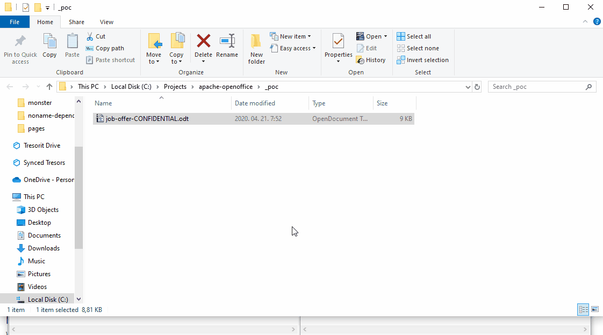

# Apache OpenOffice RCE

## Summary

Apache OpenOffice 4 (including 4.1.7, the latest version tested) is vulnerable
to remote code execution; if a victim is convinced to open a crafted .odt 
document on Windows, attackers could gain full control over their computer.

## The vulnerability

The problem is, the product does not handle script:event-listener
handlers as macro execution (like LibreOffice does). Using a construct
like this:

```
<office:scripts>
   <office:event-listeners>

    <script:event-listener script:language="ooo:script"
xlink:href=".uno:OpenHyperlinkOnCursor" script:event-name="dom:load"/>

   </office:event-listeners>
</office:scripts>
```

One can trigger opening URLs without any confirmation dialogs in OpenOffice,
including special .uno or .service link handlers that were designed for 
internal use only.



PoC document uploaded, popping the calculator on Windows. UNC targets
are also supported, in that case they're subject of the "mark of the web"
security warning of the OS.

Triggering .uno or .service actions works on Linux as well - though I
couldn't find a practical way to turn it into code execution on that OS.

## Affected versions

All Apache OpenOffice 4 versions.


## Was a CVE assigned to this issue?

No. Even though Apache is an official CVE Numbering Authority, they didn't
assign a CVE to this flaw. When asking for an ID, I was told they are about
to use CVE-2018-16858, which is a Libreoffice specific, unrelated bug. 
They are different even in nature: path traversal (CWE-23) vs protection 
mechanism failure (CWE-693). 
In the follow up Apache claimed to reuse CVE-2019-9847 insted as they 
thought the issue was the same but their original fix was incomplete. 

CVE-2019-9847 looks indeed much closer to the flaw I reported, but again, 
it is about Libreoffice. The behavior described there (clicking 
on links invokes executables without any additional user warning/prompt) 
is actually still true for OpenOffice, actually that is the reason why I
started looking for simulating clicks without user interaction. I'm
uncertain whether the fix of security issues among the office forks
are ported or not, but CVE-2019-9847 was never remediated for OpenOffice.

## Remediation

Stop using Apache OpenOffice.

## Timeline

2020-04-28: report to security@openoffice.apache.org
2020-05-01: vulnerability acknowledged
2020-06-05: asking for updates
2020-09-05: asking for a timeline, offering embargo until October
2020-09-06: confirming there is no timeline for the fix
2020-10-01: full disclosure
